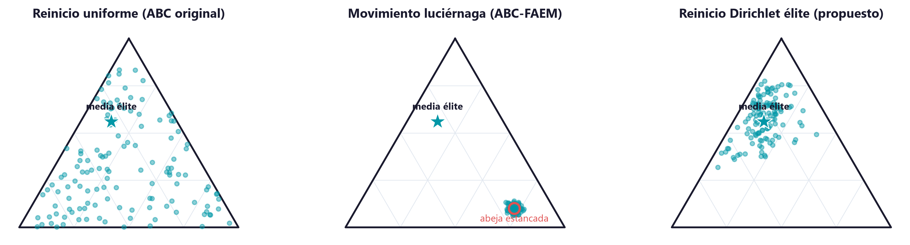

# Anexo. Análisis de activación del mecanismo scout y una línea de rediseño nativo al símplex

> Anexo complementario al comentario 9 del jurado (valor y sensibilidad del parámetro
> PFA). Documento reproducible: las cifras se generan con
> `scripts/run_scout_activation_telemetry.py` sobre los datos congelados del estudio.
> **Los resultados centrales de la tesis no se modifican:** las tablas canónicas, los
> parámetros calibrados y las conclusiones del cuerpo principal permanecen intactos y
> verificados por las pruebas de regresión del repositorio. Lo que aquí se presenta es
> un diagnóstico posterior y una línea de trabajo futuro.

## A.1. Contexto y motivación

Las variantes propuestas en esta investigación —el ABC con exploración mejorada
(ABC-FAEM) y el ABC con atracción gravitacional (ABC-GSA)— introducen su mecanismo
distintivo **dentro de la fase de scout** del Algoritmo de Colonia de Abejas
Artificiales (Karaboga, 2005). En el ABC, una abeja abandona su fuente de alimento y se
convierte en scout cuando su contador de intentos infructuosos supera un umbral de
abandono (`max_trials`); en ese momento, en lugar de reiniciarse de forma aleatoria como
en el algoritmo original, las variantes propuestas ejecutan un movimiento guiado —una
atracción tipo luciérnaga (Yang, 2009) hacia una élite en el caso del ABC-FAEM, o una
fuerza gravitacional neta en el caso del ABC-GSA—.

Durante la revisión, el jurado planteó una pregunta pertinente sobre el disparador
probabilístico de este mecanismo (parámetro PFA) y su sensibilidad. Al responderla con
rigor surgió una observación de fondo que merece quedar documentada de manera explícita:
**bajo la configuración calibrada de la tesis, la fase de scout no llega a activarse
dentro del horizonte de ejecución empleado.** Este anexo caracteriza ese fenómeno con
instrumentación cuantitativa, discute su interpretación correcta —que corresponde a un
resultado de la calibración y no a un defecto de diseño— y presenta una línea de
rediseño que, en pruebas preliminares, vuelve el mecanismo operativo y mejora el
desempeño frente al ABC original.

## A.2. Diagnóstico: la fase de scout no se activa bajo la calibración

El umbral de abandono se deriva de forma proporcional a la dimensión del problema,
`max_trials = 0.6 × 25 abejas × 20 activos = 300`. Sin embargo, el contador de intentos
de una abeja solo crece cuando un movimiento no logra mejorar su fuente, y dentro del
presupuesto de 60 iteraciones de las corridas canónicas dicho contador alcanza un máximo
observado cercano a **19**. En consecuencia, ninguna abeja supera el umbral de 300 y la
fase de scout **no se ejecuta en ninguna corrida del estudio** (ambos universos, los
cuatro regímenes de volatilidad y las 20 semillas). La telemetría descrita en la sección
A.3 lo confirma de forma directa: el número medio de activaciones del scout es
exactamente **cero** en todas las celdas régimen–universo bajo la configuración
calibrada.

Esta observación tiene una lectura mecánica importante para la interpretación de los
resultados. Dado que las cuatro versiones del ABC comparten la misma dinámica de abejas
empleadas y observadoras antes de la fase de scout, y dado que dicha fase no se activa,
la diferencia distintiva entre el ABC original, el ABC-FAEM y el ABC-GSA no se ejercita
en la muestra; las diferencias observadas entre ellos en las tablas de resultados
provienen predominantemente de sus trayectorias estocásticas —flujos de números
aleatorios distintos— y no del rediseño del scout en sí. **Es fundamental subrayar que
esto no afecta el resultado central de la tesis:** la dominancia de la familia
bio-inspirada (ABC original más las dos variantes propuestas) sobre los referentes
clásicos —la optimización media-varianza de Markowitz y la asignación equiponderada
1/N— en el ratio de Sortino, en todos los regímenes y universos, es independiente de la
activación del scout y permanece plenamente válida.

La interpretación correcta es que la calibración robusta multi-régimen, al seleccionar
el factor de abandono bajo un criterio de peor-caso en Sortino, determinó que para estos
paisajes de optimización y estos horizontes la explotación sostenida sin reinicios es la
estrategia preferible. El mecanismo de scout es, por diseño, una **contingencia frente
al estancamiento**; la calibración —no los autores— concluyó que dicha contingencia no
resultaba necesaria dentro de la muestra. Esta distinción es consistente con hallazgos
previos de la literatura sobre el ABC (sección A.6), en los que el operador de scout se
vuelve efectivamente inactivo bajo determinadas calibraciones sin que ello degrade el
desempeño.

## A.3. Instrumentación: telemetría de activación como diagnóstico de primera clase

Para pasar de una inferencia indirecta a una medición explícita, se instrumentó el
resultado de cada ejecución del optimizador con dos indicadores de activación: el número
de veces que la fase de scout se dispara durante la corrida y las iteraciones en que lo
hace. Esta telemetría permite auditar de forma directa cuándo y con qué frecuencia el
mecanismo entra en operación, y convierte la pregunta del jurado en una cantidad
observable y reproducible en lugar de una conjetura.

El Cuadro A.1 reporta el número medio de activaciones por corrida (ambos universos)
para el ABC original, el ABC-FAEM en su configuración congelada y un conjunto de
configuraciones exploratorias con umbrales de abandono proporcionales al presupuesto de
iteraciones (definidas en la sección A.4).

**Cuadro A.1. Activaciones medias del scout por corrida.**

| Configuración | COVID-19 (2020) | GFC (2007–2009) | Guerra (2022) | Estabilidad (2023–2024) |
| --- | ---: | ---: | ---: | ---: |
| ABC original (calibrado) | 0.0 | 0.0 | 0.0 | 0.0 |
| ABC-FAEM congelado (`max_trials`=300) | 0.0 | 0.0 | 0.0 | 0.0 |
| Reinicio Dirichlet, fracción 0.15 | 12.3 | 13.1 | 10.9 | 12.3 |

La evidencia es inequívoca: bajo la configuración calibrada el mecanismo permanece
dormido, mientras que un umbral proporcional al horizonte de 60 iteraciones lo vuelve
operativo a una tasa controlada. Conviene notar que esta activación es de bajo costo
computacional —del orden de doce reinicios frente a las aproximadamente 3.100
evaluaciones de la función objetivo por corrida, es decir, cerca del 0,4 %—, por lo que
las mejoras que se reportan a continuación no son atribuibles a un mayor presupuesto de
búsqueda.

## A.4. Una línea de rediseño: reinicio Dirichlet guiado por élites, nativo al símplex

El diagnóstico anterior separa dos preguntas que conviene tratar por separado: *hacer
que el scout se active* y *lograr que su activación aporte valor*. La evidencia muestra
que la primera no basta. En efecto, cuando se reduce el umbral de abandono para forzar la
activación, el movimiento de recuperación tipo luciérnaga del ABC-FAEM aporta una mejora
marginal e inconsistente entre regímenes. La razón es geométrica: la atracción tipo
luciérnaga decae con el cuadrado de la distancia, `exp(-γ·r²)`, y a la dimensionalidad
del problema de portafolio (veinte activos) la distancia típica entre abejas hace que
dicha atracción se aproxime a **0,01**; en la práctica, el movimiento "guiado" degenera
en ruido y la abeja apenas se desplaza de su posición estancada.

Esta observación motiva un rediseño del movimiento de recuperación que respete la
geometría propia del problema. Conviene precisar dicha geometría. El conjunto de
portafolios *long-only* factibles —vectores de pesos no negativos que suman uno—
constituye el **símplex de probabilidad**: un objeto geométrico cuyos vértices
representan la concentración total en un único activo, cuyo baricentro corresponde a la
asignación equiponderada (1/N) y cuyas aristas y caras corresponden a portafolios que
emplean solo un subconjunto de los activos (Figura A.1). Los operadores de recuperación
que perturban la solución en el **espacio de caja** —el reinicio aleatorio uniforme del
ABC original o el desplazamiento tipo luciérnaga— generan candidatos que, en general, no
pertenecen a este conjunto y exigen una renormalización posterior; ese parche distorsiona
la perturbación pretendida y no aprovecha la estructura del problema.

Se propone entonces un operador de reinicio que, en lugar de operar en el espacio de
caja, recompone la solución directamente sobre el símplex: cuando una abeja se estanca,
se reinicia mediante una extracción de una **distribución de Dirichlet concentrada
alrededor de la dirección media de las soluciones élite**. La distribución de Dirichlet
reside sobre el símplex por construcción, de modo que todo candidato es un portafolio
factible sin necesidad de reparación ni proyección; su vector de concentración regula el
equilibrio entre intensificación (permanecer cerca de la región élite) y exploración
(diversificar la composición). En términos intuitivos, mientras que el reinicio en caja
equivale a generar puntos en un espacio más amplio que luego deben forzarse a ser
válidos, el muestreo de Dirichlet **genera portafolios válidos desde el origen** y
permite orientarlos hacia la región donde la colonia ha identificado las mejores
soluciones. La Figura A.1 ilustra este contraste sobre un símplex de tres activos: el
reinicio uniforme dispersa los candidatos por todo el símplex, mientras que el reinicio
Dirichlet los concentra alrededor de la dirección media de la élite.

La intuición es que un operador nativo al símplex aprovecha la información acumulada por
la colonia —la dirección de las soluciones prometedoras— y la expresa en la geometría
correcta, algo que ni el reinicio aleatorio uniforme del ABC original (que ignora todo
lo aprendido) ni el movimiento de caja del ABC-FAEM (que se anula en alta dimensión)
consiguen.

**Figura A.1.** Reubicación de una abeja estancada sobre el símplex de portafolios de
tres activos, según la política de recuperación. El reinicio uniforme del ABC original
(izquierda) dispersa los candidatos por todo el símplex, ignorando la información
acumulada por la colonia; el movimiento tipo luciérnaga del ABC-FAEM (centro) apenas
desplaza la abeja de su posición estancada, pues la atracción se anula a la
dimensionalidad del problema; el reinicio Dirichlet propuesto (derecha) concentra los
candidatos alrededor de la dirección media de las soluciones élite, generando
portafolios factibles por construcción. Esquema reproducible generado con
`scripts/generate_scout_simplex_figure.py` (semilla fija).

## A.5. Evaluación estadística

La comparación se realizó con semillas pareadas idénticas entre configuraciones —a
diferencia del esquema de desplazamiento de semillas por modelo empleado en las corridas
canónicas—, de modo que las pruebas de significancia fueran genuinamente pareadas; por
esta razón las cifras difieren, por construcción, de las tablas canónicas del cuerpo
principal. El Cuadro A.2 reporta el ratio de Sortino medio por semilla del operador
Dirichlet propuesto frente al ABC original, en el universo de fundamentales.

**Cuadro A.2. Ratio de Sortino medio por semilla (universo de fundamentales).**

| Régimen | ABC original | Reinicio Dirichlet (f=0.15) | Diferencia |
| --- | ---: | ---: | ---: |
| COVID-19 (2020) | 4.194 | 5.581 | +1.387 |
| GFC (2007–2009) | 0.237 | 0.536 | +0.299 |
| Guerra (2022) | 0.482 | 1.220 | +0.738 |
| Estabilidad (2023–2024) | 4.476 | 4.828 | +0.352 |

Agregando las ocho celdas régimen–universo, el operador Dirichlet eleva el Sortino medio
por semilla de 2.145 a **2.870** frente al ABC original, y logra además el mejor valor
medio de la función objetivo ejecutada (ecuación de utilidad de la tesis), lo que indica
que encuentra mejores óptimos del problema y no simplemente valores más favorables de la
métrica de evaluación.

Para controlar el riesgo de comparaciones múltiples, las pruebas de Wilcoxon de rangos
con signo frente al ABC original se corrigieron con el procedimiento de Holm (1979)
dentro de cada celda, tomando como familia las seis configuraciones no basales. El
operador Dirichlet resulta significativamente superior al ABC original, y a favor suyo,
en **las ocho celdas** régimen–universo tras la corrección de Holm; ninguna otra
configuración examinada gana una sola celda corregida.

Como prueba adicional de integridad frente a la selección, se calculó el ratio de Sharpe
deflactado (Bailey y López de Prado, 2014) del mejor portafolio del operador en cada
celda, deflactado contra el conjunto de ensayos de las siete configuraciones. El
resultado es matizado y conviene reportarlo con honestidad: el Sharpe deflactado supera
el umbral de 0,95 en cuatro de las ocho celdas —los regímenes de COVID-19 y de
estabilidad, en ambos universos, con valores de hasta 1,000— pero se sitúa entre 0,51 y
0,72 en los regímenes de la GFC y de la guerra. La lectura es directa: la superioridad
*relativa* del operador frente al ABC original sobrevive al control por comparaciones
múltiples en todas las celdas, mientras que su capacidad *absoluta* de generar
desempeño distinguible del azar de selección solo queda establecida en los regímenes de
menor turbulencia, donde el propio Sharpe absoluto del portafolio ganador es
suficientemente alto.

## A.6. Relación con la literatura

El fenómeno de un operador de scout que permanece inactivo bajo la calibración empleada
no es exclusivo de este trabajo. Bullinaria y AlYahya (2014) observaron empíricamente
que, con la calibración por defecto del ABC, la fase de scout esencialmente no se activa,
y la declararon redundante mediante un experimento de ablación sobre el umbral de
abandono. Singh y Deep (2019) llegaron a una conclusión afín al analizar el balance
exploración–explotación del ABC, señalando que el operador de scout puede volverse
redundante en problemas de alta dimensión. Hussain et al. (2020), mediante un análisis
componente a componente basado en medición de diversidad, reportan igualmente que el
componente de scout puede resultar poco contributivo. La contribución de este anexo
respecto a esa línea es doble: instrumentar la activación como diagnóstico de primera
clase ligado a una función objetivo financiera, y —a diferencia de esos trabajos, que se
detienen en el diagnóstico— acoplar la auditoría a un rediseño que recupera valor.

En cuanto al operador propuesto, el uso de la distribución de Dirichlet para representar
pesos de portafolios *long-only* sobre el símplex está bien establecido en la literatura
financiera (André y Coqueret, 2020; Yang, Park y Lee, 2022; Le Courtois y Xu, 2024),
si bien en contextos de aprendizaje por refuerzo o de construcción directa del conjunto
eficiente, y no como operador dentro de una metaheurística. El precedente más cercano en
el ámbito del ABC para portafolios es la variante de scout informado por un archivo de
soluciones eficientes; la diferencia esencial del operador aquí propuesto radica en el
muestreo Dirichlet condicionado a la dirección media de la élite sobre el símplex, en
lugar de la reselección de soluciones previas. Hasta donde alcanzó la revisión realizada,
esta combinación específica —disparador por estancamiento, muestreo nativo al símplex y
condicionamiento a la media élite dentro del ABC— no aparece documentada en la
literatura, lo que sugiere una línea de investigación abierta.

## A.7. Alcance, limitaciones y trabajo futuro

Los resultados de este anexo son **diagnósticos exploratorios y no reemplazan los
resultados congelados de la tesis**. Deben leerse con tres salvedades explícitas.
Primero, la evaluación se realizó dentro de la muestra, sobre las mismas ventanas
temporales del estudio; no constituye todavía una validación fuera de muestra. Segundo,
las configuraciones del operador emplean valores por defecto sin una calibración
dedicada equivalente a la del resto de la tesis. Tercero, el Sharpe deflactado se calculó
frente a las siete configuraciones examinadas y no frente al espacio completo de diseño.

En consecuencia, el paso confirmatorio natural es una validación *walk-forward* fuera de
muestra sobre el panel histórico completo, con calibración dedicada del parámetro de
concentración y del umbral de activación, incorporación de costos de transacción y, de
ser posible, universos de mayor tamaño. Ese programa excede el alcance del presente
trabajo de grado y se plantea como línea de investigación futura, en continuidad directa
con la observación del jurado: la limitación identificada en el mecanismo de scout no
solo quedó documentada y explicada, sino que se transformó en un diseño instrumentado,
medido y reproducible que abre una vía concreta de mejora para la familia de algoritmos
propuesta.

## Referencias

André, E., y Coqueret, G. (2020). *Dirichlet policies for reinforced factor portfolios*
[preprint]. arXiv:2011.05381.

Bailey, D. H., y López de Prado, M. (2014). The deflated Sharpe ratio: Correcting for
selection bias, backtest overfitting, and non-normality. *The Journal of Portfolio
Management*, 40(5), 94–107.

Bullinaria, J. A., y AlYahya, K. (2014). Artificial Bee Colony training of neural
networks. En G. Terrazas, F. E. B. Otero y A. D. Masegosa (Eds.), *Nature Inspired
Cooperative Strategies for Optimization (NICSO 2013)* (Studies in Computational
Intelligence, Vol. 512, pp. 191–201). Springer.

Holm, S. (1979). A simple sequentially rejective multiple test procedure. *Scandinavian
Journal of Statistics*, 6(2), 65–70.

Hussain, K., Mohd Salleh, M. N., Cheng, S., Shi, Y., y Naseem, R. (2020). Artificial bee
colony algorithm: A component-wise analysis using diversity measurement. *Journal of
King Saud University – Computer and Information Sciences*, 32(7), 794–808.

Karaboga, D. (2005). *An idea based on honey bee swarm for numerical optimization*
(Technical Report TR-06). Erciyes University.

Le Courtois, O., y Xu, X. (2024). Efficient portfolios and extreme risks: A
Pareto–Dirichlet approach. *Annals of Operations Research*, 335(1), 261–292.

Singh, A., y Deep, K. (2019). Exploration–exploitation balance in Artificial Bee Colony
algorithm: A critical analysis. *Soft Computing*, 23, 9525–9536.

Yang, H., Park, H., y Lee, K. (2022). A selective portfolio management algorithm with
off-policy reinforcement learning using Dirichlet distribution. *Axioms*, 11(12), 664.

Yang, X.-S. (2009). Firefly algorithms for multimodal optimization. En *Stochastic
Algorithms: Foundations and Applications (SAGA 2009)* (Lecture Notes in Computer
Science, Vol. 5792, pp. 169–178). Springer.
