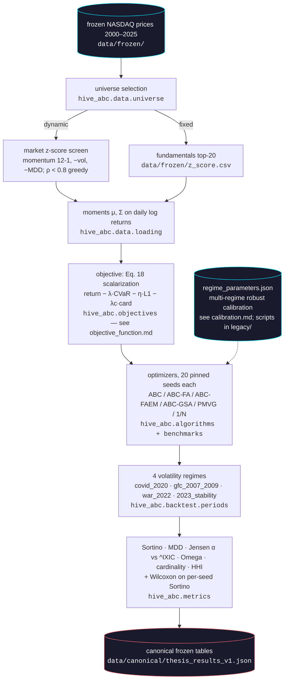

# Methodology map: thesis → repository

How each stage of the thesis methodology (§Metodología) maps to this
repository. The thesis document itself is frozen under [`thesis/`](../../thesis);
this note is the engineer's index into it.

## Pipeline

## The z-score selection stage, exactly (committee comment 6)

The committee asked for the exact windows, aggregation weights, and
selection thresholds of the z-score filters (thesis pp. 16–17). As
executed (`hive_abc.data.universe`, faithful to the frozen harness):

**Dynamic market z-score** (recomputed ex-ante per backtest window):

- **Window**: the 252 calendar days ending the day before the backtest
  start (no test-window data — the look-ahead-bias control); tickers need
  ≥ 180 observations in that window (relaxed once to 120 if none survive).
- **Factors** (on daily log returns): momentum 12-1 = cumulative return
  excluding the most recent 21 rows; volatility = std of returns;
  max drawdown of the compounded path.
- **Aggregation**: `score = 0.5·z(momentum) + 0.3·z(−volatility)
  + 0.2·z(−max drawdown)` with population z-scores (ddof = 0).
- **Selection**: rank descending, greedily accept tickers whose absolute
  return correlation with every already-selected ticker is < 0.8; top up
  ignoring correlation if fewer than 20 survive; cut to exactly n = 20.

**Fixed fundamentals z-score** (static): top-20 rows of
`data/frozen/z_score.csv` by `Z_Score` (semicolon-delimited, decimal
commas), excluding the `NASDAQ_100` index row. The underlying fundamentals
aggregation (margins, ROACE/ROATA, P/E, P/B, PEG, current ratio, leverage)
was computed outside this pipeline and is frozen in that file.

## Reference literature

The thesis's reference corpus (30+ papers) is not committed here — the PDFs
remain in the original research workspace (`Hive ABC/docs/Artículos`). Key
citations used by the code are quoted in the algorithm docstrings:

- Karaboga, D. (2005). *An idea based on honey bee swarm for numerical
  optimization*. Technical Report TR-06, Erciyes University.
- Karaboga, D., & Akay, B. (2009). *A comparative study of the artificial
  bee colony algorithm*. Applied Mathematics and Computation, 214(1).
- Yang, X.-S. (2009). *Firefly algorithms for multimodal optimization*.
  SAGA 2009.
- Tuba, M., & Bacanin, N. (2014). *Artificial bee colony algorithm
  hybridized with firefly algorithm for cardinality constrained
  mean-variance portfolio selection*. Applied Mathematics & Information
  Sciences, 8(6). — the original ABC-FA implementation credited by
  `ABCFABacanin`.
- Rashedi, E., Nezamabadi-pour, H., & Saryazdi, S. (2009). *GSA: A
  gravitational search algorithm*. Information Sciences, 179(13).
- Ertenlice, O., & Kalayci, C. B. (2018). *A survey of swarm intelligence
  for portfolio optimization*. Swarm and Evolutionary Computation, 39.
- Markowitz, H. (1952). *Portfolio selection*. The Journal of Finance, 7(1).

## Known deviations from the legacy pipeline

Documented, intentional, and guarded by the reproduction tiers:

1. **Seeding** — pinned seeds + stable per-model offsets replace the
   unseeded `random.randint` draw and the platform-dependent per-class hash
   derivation. Statistical (band) reproduction is the contract.
2. **Benchmark data** — Jensen alpha reads the frozen
   `data/frozen/benchmark_ixic_2007_2024.csv` instead of downloading ^IXIC
   at runtime (values shift ≤ 0.06 from Yahoo revisions).
3. **Convex solver** — Clarabel (with SCS fallback) replaces the deprecated
   ECOS; min-variance solutions agree to ~1e-6.
4. **Metrics** — native quantstats-parity implementations replace the
   quantstats/riskfolio runtime dependencies (locked by `-m parity` tests).
